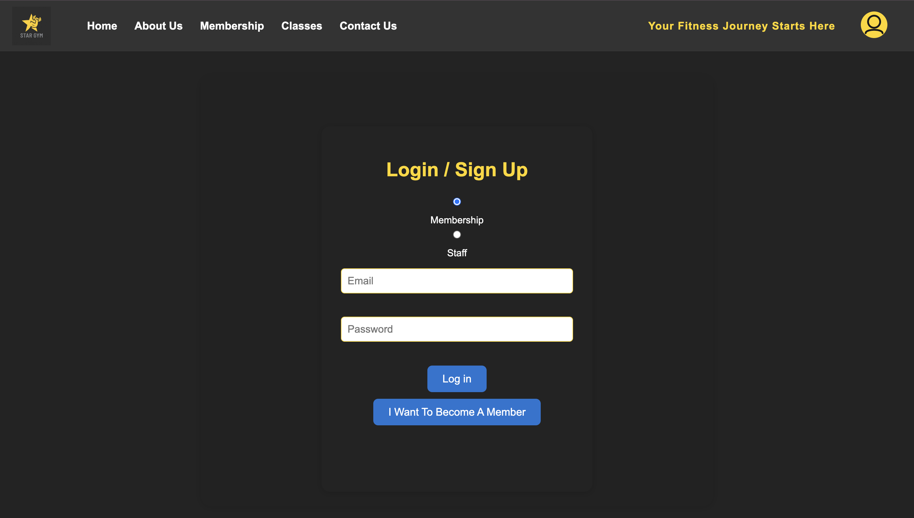
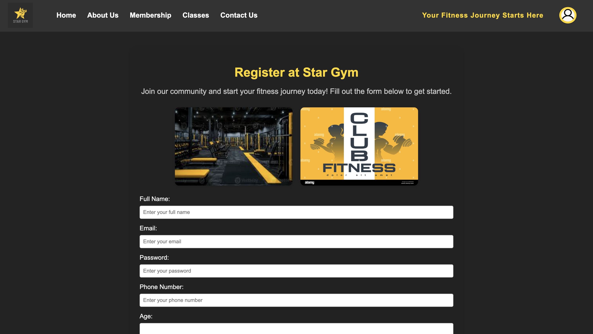
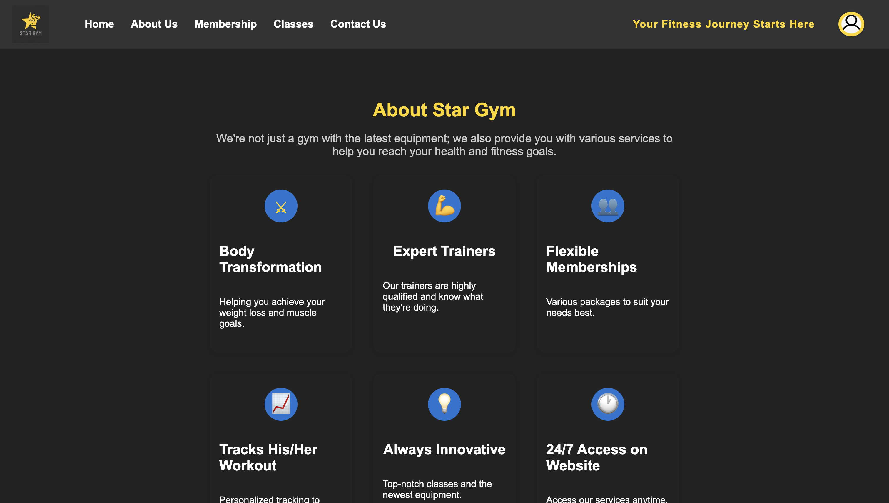
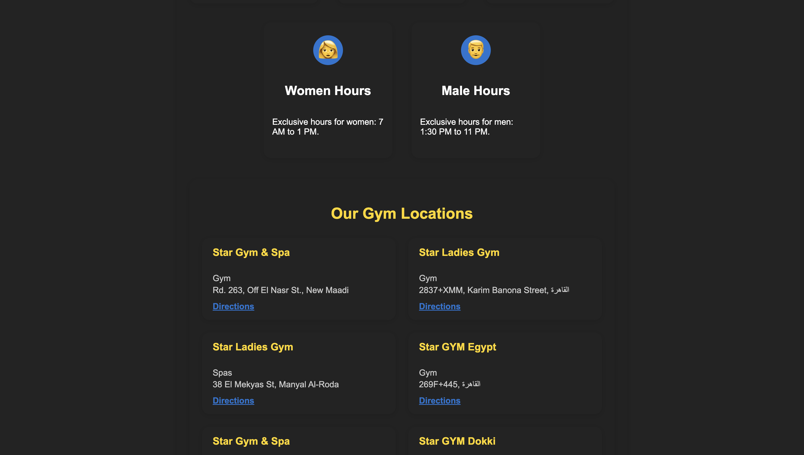
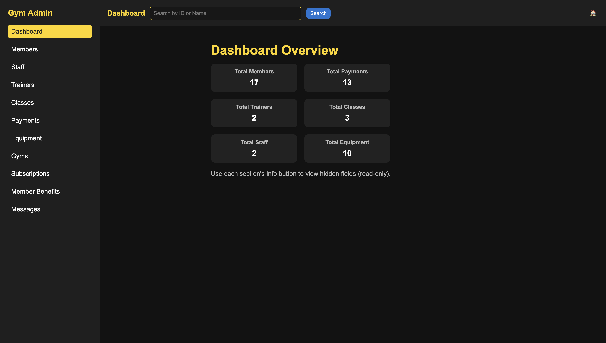
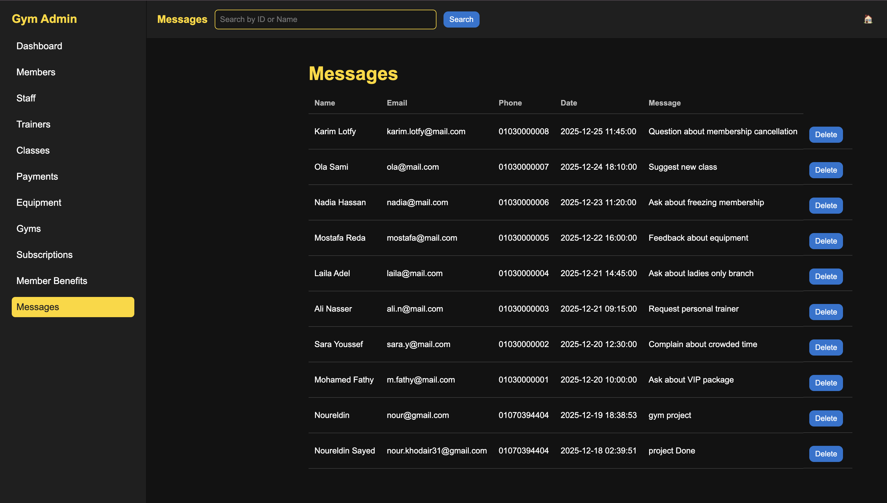
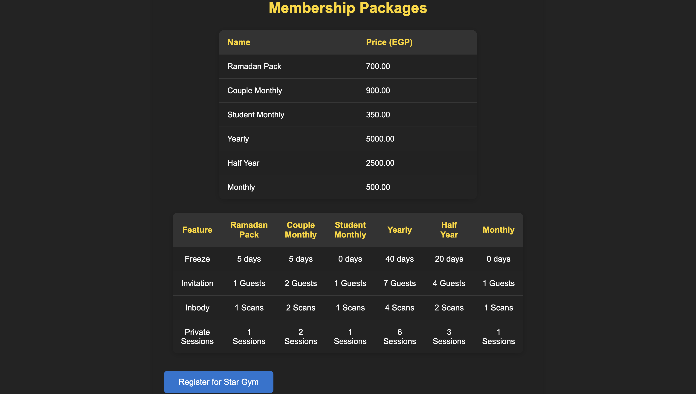
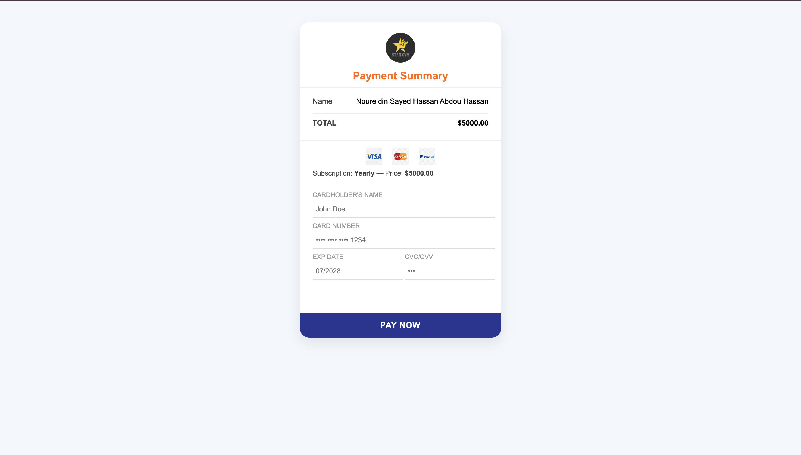
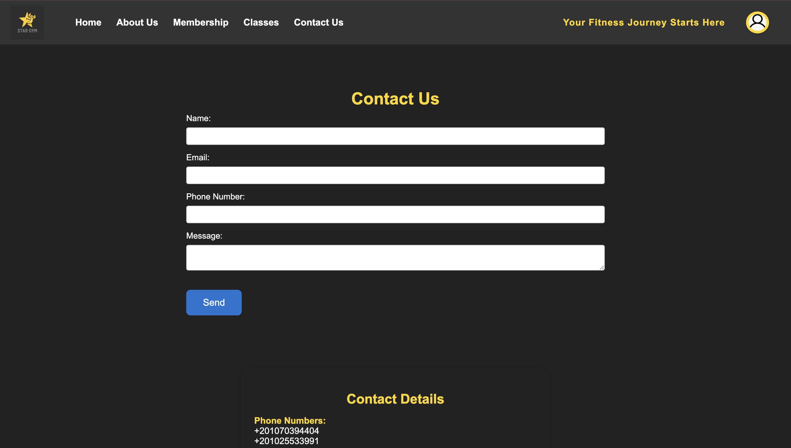

# 🏋️ Gym Management Web Application

A full-stack Gym Management Web Application developed individually to manage gym members, subscriptions, and administrative operations.

---

## 🚀 Features
- 🔐 User Registration & Secure Login
- 👤 Personalized Member Profiles
- 🛠 Admin Dashboard (Employees Only)
- 📋 Membership Subscription System
- 💳 Payment Page Simulation
- 🗄 Structured MySQL Database Integration
- 🔄 Role-Based Access Control

---

## 🛠 Tech Stack
**Frontend:**
- HTML
- CSS
- JavaScript

**Backend:**
- PHP

**Database:**
- MySQL (phpMyAdmin)

**Version Control:**
- Git & GitHub

---

## 📂 Project Structure:
gym-management-system/
│
├── index.html
├── login.php
├── register.php
├── db.php
├── api.php
├── css/
├── js/
├── images/
└── ...


---

## ⚙️ How to Run Locally
1. Install XAMPP or WAMP
2. Clone the repository:
   ```bash
   git clone https://github.com/noureldinkhodair/gym-management-system.git
3. Move the project folder to htdocs
4. Import the database into phpMyAdmin
5. Open in browser:
   ```bash
      http://localhost/webprograming project (gym)/index.html


## 🎯 Project Purpose
This project was built to strengthen my full-stack development skills, particularly in:

Authentication Systems

Database Design

Role-Based Access

Backend Logic Implementation


## 👨‍💻 About Me

Computer Science student at MSA University
Interested in Data Analytics & Cybersecurity
Continuously building practical projects to enhance my technical expertise.


## 📸 Screenshots

### 🔐 Login Page


### 📝 Register Page


### 🏠 Home Page


### ℹ️ About Page


### ℹ️ About (Section 2)


### 📊 Admin Dashboard


### 📊 Admin Dashboard (Detailed View)


### 💳 Membership Page


### 💰 Payment Page


### 📞 Contact Page

